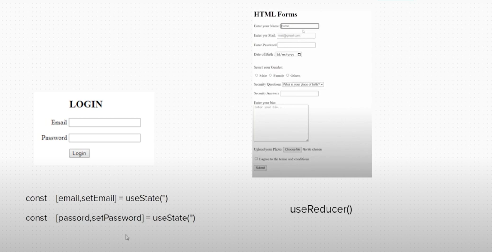
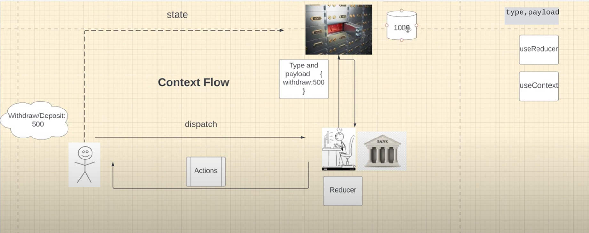
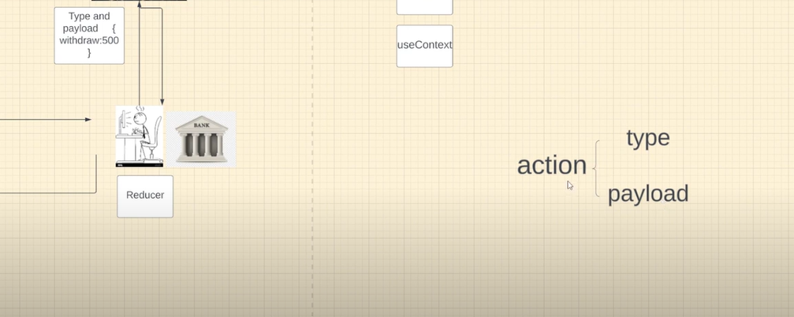

# Reducer

## UseReducer

-   To manage a complex state.

*   useState - To create State variables [Can Handle the primitive values easily]
*   useReducer - To create State variables. but complex like big forms.







Reducer is the one changes the State and it gives the actions as well.

useReducer has 2 parameters - Reducer, InitialState and returns state, dispatch
Ex:- const [state, dispatch] = useReducer(Reducer, InitialState)

Reducer is the one which is changing InitialState.
Action has 2 types. type and payload.
Ex:- type is the method like withdraw and payload is the amount/value(500).

```
dispatch({type: "WITHDRAW, payload: 500})
```

Ex:

```
    const transactionReducer = (state, action) => {
        switch (action.type) {
            case "WITHDRAW":
                return state - action.payload;
            case "DEPOSIT":
                return state + action.payload;
            default:
                return state;
        }
    };

    const [state, dispatch] = useReducer(transactionReducer, 1000);

```
